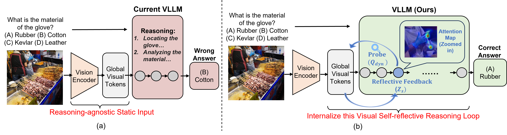
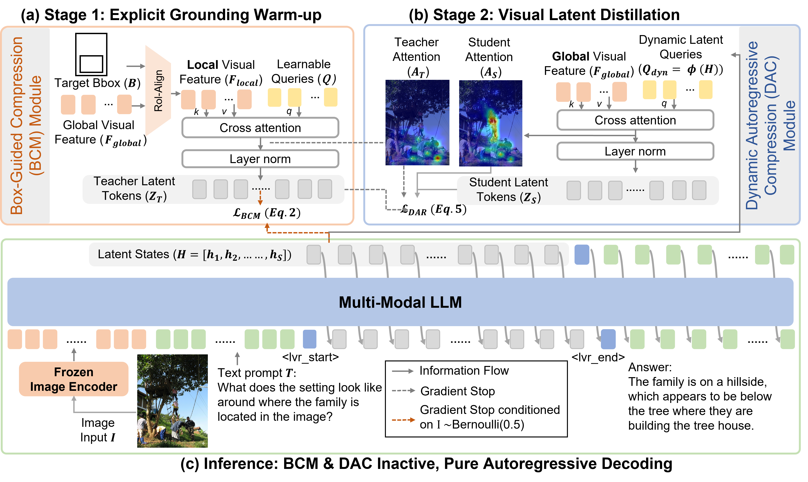

<p align="center">
  
</p>


[](.)
[](https://huggingface.co/garlandchou/V-Reflection)
[](https://github.com/IDEA-Research/V-Reflection)


This repository contains the official implementation of **V-Reflection**, a framework that transforms the MLLM into an **active interrogator** through a "think-then-look" visual reflection mechanism.

<p align="center">
  
</p>


## Installation

```bash
conda env create -f environment.yaml
conda activate train
pip install qwen-vl-utils
pip install flash-attn --no-build-isolation
```

**Note:** Install flash-attn after the other packages (requires CUDA build). For wandb logging, run `wandb login` or set `WANDB_API_KEY`.
## Data Preparation

### 1. Download Annotations

We provide pre-formatted LVR training data. Download from [Huggingface](https://huggingface.co/garlandchou/V-Reflection) and place the JSON files in `./data/`.

The directory structure after downloading should be:

```shell
data/
├── meta_data_lvr_sft_stage1.json       # Meta config for default (SROIE + DUDE)
├── viscot_sroie_dude_lvr_formatted.json # SROIE + DUDE subset
└── viscot_363k_lvr_formatted.json      # Full 363K Visual CoT dataset
```

### 2. Download Images

Download images for the [Visual CoT](https://github.com/deepcs233/Visual-CoT) dataset. Some sources may require registration or form completion.

| Dataset | Source |
|:-------:|:------:|
| COCO | [train2017](https://cocodataset.org/#download) / [train2014](https://cocodataset.org/#download) |
| GQA | [images](https://cs.stanford.edu/people/dorarad/gqa/download.html) |
| Flickr30k | [homepage](https://www.kaggle.com/datasets/hsankesara/flickr-image-dataset) |
| TextVQA | [train_val_images](https://textvqa.org/dataset/) |
| DocVQA | [homepage](https://rrc.cvc.uab.es/?ch=17) |
| InfographicsVQA | [homepage](https://rrc.cvc.uab.es/?ch=17) |
| Open Images | [download script](https://github.com/deepcs233/Visual-CoT) (splits 0–5) |
| VSR | [images](https://github.com/cambridgeltl/visual-spatial-reasoning) |
| DUDE | [images](https://github.com/deepcs233/Visual-CoT) |
| SROIE | [homepage](https://rrc.cvc.uab.es/?ch=13) |
| CUB | [images](https://www.vision.caltech.edu/datasets/cub_200_2011/) |
| Visual7W | [repo](https://github.com/deepcs233/Visual-CoT) |

### 3. Organize Directory Structure

Place images under `{image_folder}` (e.g. `./data/images` or your custom path). The structure should match the paths in the annotation JSON:

```shell
{image_folder}/
├── coco/
│   ├── train2017/
│   └── train2014/
├── gqa/
│   └── images/
├── flickr30k/
│   └── flickr30k-images/
├── textvqa/
│   └── train_images/
├── docvqa/
├── infographicsvqa/
├── openimages/          # only need train_0 ... train_5
├── vsr/
│   └── images/
├── dude/
│   └── viscot/dude/      # or DUDE_train-val-test_binaries/images/train/
├── sroie/
│   └── viscot/sroie/
├── cub/
│   └── CUB_200_2011/images/
└── visual7w/
    └── images/
```

### 4. Dataset Configuration

Set `--data_path` to a meta JSON that lists your formatted datasets. Example `data/meta_data_lvr_sft_stage1.json`:

```json
[
  {"ds_name": "viscot_1", "data_path": "data/viscot_sroie_dude_lvr_formatted.json", "image_folder": "/path/to/images", "ds_type": "Q_A"},
  {"ds_name": "viscot_2", "data_path": "data/viscot_363k_lvr_formatted.json", "image_folder": "/path/to/images", "ds_type": "Q_A"}
]
```

### 5. Data Format

Each entry follows LLaVA specification with `image`, `conversations`, and `bboxes`. The `<image>` and `<lvr>` are placeholders for data collation.

<details>
<summary>Example dataset entry</summary>

```json
{
  "dataset": "flickr30k",
  "image": ["viscot/flickr30k/2618322793.jpg"],
  "conversations": [
    {"from": "human", "value": "<image>\nCan you describe the lower apparel of the child on the swing?\nProvide a short and direct response."},
    {"from": "gpt", "value": "<lvr>\n<answer> The child on the swing is wearing dark blue denim shorts. </answer>"}
  ],
  "bboxes": [[0.382, 0.456, 0.718, 0.656]]
}
```

</details>

## Evaluation

First, download our provided [model weights](https://huggingface.co/garlandchou/V-Reflection), and set `EVAL_CHECKPOINT_PATH` to your checkpoint directory.


For full benchmark evaluation (BLINK, MMVP, VSTAR, HRBench4K, HRBench8K, MME-RealWorld-Lite):

```bash
bash scripts_release/evaluation/evaluation_7b_stage2.sh
```

## Training

**Prerequisites:** Download the base model [Qwen2.5-VL-7B-Instruct](https://huggingface.co/Qwen/Qwen2.5-VL-7B-Instruct) from HuggingFace before training. The training scripts load it by default via `Qwen/Qwen2.5-VL-7B-Instruct` (or set `HF_HOME` / `TRANSFORMERS_CACHE` for custom cache paths).

**Stage 1 (Box-Guided Compression):** Compresses variable-length bbox visual features into fixed 8 latent tokens via cross-attention. Set `--data_path` and `--image_folder` in the script.

```bash
bash scripts_release/train/sft_7b_stage1_box_resampler.sh
```

**Stage 2 (Dynamic Autoregressive Compression):** Teacher-Student distillation. Requires a Stage 1 checkpoint.

```bash
export CHECKPOINT_PATH="path/to/stage1_checkpoint"
bash scripts_release/train/sft_7b_stage2_distillation.sh
```

**Note:** We use data packing (InternVL-style). Enable with `--enable_data_packing True`.

## Models

We provide checkpoints for V-Reflection. Results on visual perception and high-resolution benchmarks:

| Benchmark | [V-Reflection (ours) Download](https://huggingface.co/garlandchou/V-Reflection) | Qwen2.5-VL-7B |
|:---------:|:-------------------:|:-------------:|
| MMVP      | **72.3**             | 66.7          |
| BLINK     | **56.4**             | 54.5          |
| V*        | **81.7**             | 78.5          |
| HRBench-4K | **72.6**            | 68.0          |
| HRBench-8K | **66.3**            | 63.8          |
| MME-Real-Lite | **53.9**         | 45.8          |

## Method

<p align="center">
  
</p>

- **Stage 1 (BCM):** Box-Guided Compression establishes stable pixel-to-latent targets through explicit spatial grounding, with *Stochastic Decoupled Alignment* — bidirectional symmetric loss to jointly train resampler and LLM.
- **Stage 2 (DAC):** Dynamic Autoregressive Compression maps the model's hidden states into dynamic probes that interrogate the global visual feature map. Student uses LLM hidden states as Queries, full-image features as K/V, MSE distillation from frozen BCM Teacher.
- **Inference:** Both BCM and DAC remain entirely inactive. Purely end-to-end autoregressive decoding in the latent space — `last_position_hidden_state` as next-step input embedding for 8-step latent reasoning with optimal efficiency.

## Qualitative Results

Visualizations confirm that latent reasoning autonomously localizes task-critical visual evidence.

**Training Attention (Stage 2):** Teacher vs Student attention maps during distillation.

<p align="center">
  
</p>

**Inference Attention:** Latent reasoning visualization — dynamic probes interrogate the visual feature space during inference.

<p align="center">
  
</p>

## Citation

If you find this work helpful for your research, please cite:

```bibtex
@misc{li2025lvr,
  title={Latent Visual Reasoning},
  author={Bangzheng Li and Ximeng Sun and Jiang Liu and Ze Wang and Jialian Wu and Xiaodong Yu and Hao Chen and Emad Barsoum and Muhao Chen and Zicheng Liu},
  year={2025},
  journal={arXiv preprint arXiv:2509.24251}
}
```

## Acknowledgement

We would like to thank the authors of the following projects for their excellent work:

- [Qwen2.5-VL](https://github.com/QwenLM/Qwen2.5-VL) - MLLM series from Qwen family
- [LVR](https://github.com/VincentLeebang/lvr) - Latent Visual Reasoning model by Vincent Lee
- [Visual-CoT](https://github.com/deepcs233/Visual-CoT) - Visual CoT dataset
- [InternVL](https://github.com/OpenGVLab/InternVL) - Open-source MLLM family by Shanghai AI Lab

## License

This project is licensed under the Apache-2.0 License. See the [LICENSE](LICENSE) file for details.
